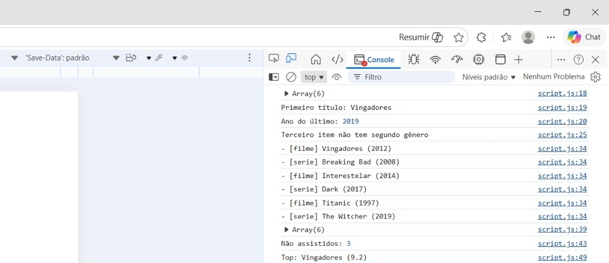
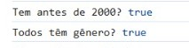
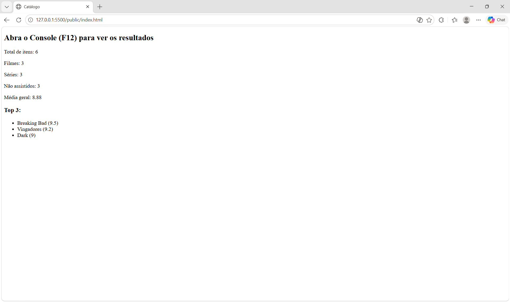

# Trabalho Prático - Semana 8

Nesta atividade, você irá fazer exercícios de programação com o objetivo de praticar a manipulação de objetos e arrays em JavaScript, passando pela definição de dados em notação **JSON (JavaScript Object Notation)**, acessando propriedades e itens, e usando iterators para processar os dados e gerar resultados.

## Informações Gerais

- Nome:Adriano de Jesus Alves
- Matrícula:906517

## Prints do console do navegador

<<  COLOQUE A IMAGEM - LISTAGEM DE TÍTULOS - AQUI >>

<<  COLOQUE A IMAGEM - CÁLCULO DE MÉDIAS - AQUI >>

<<  COLOQUE A IMAGEM - RESUMO DE VERIFICAÇÕES (SOME E EVERY) - AQUI >>

<<  COLOQUE A IMAGEM - PÁGINA COM O RESUMO - AQUI >>

